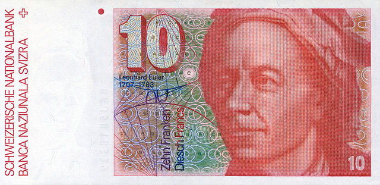

layout: true
class: middle, center

---

# Number Theory: Why Cryptography Works


_"The Wizard of Evergreen Terrace"_

???
Hi fellow Chicago Rubyists!
Today I'm here to talk to you about Number Theory.
It's an interesting topic and also a really important topic,
and one that people who write Ruby mostly don't seem to deal with much, which is unfortunate.
This image is from an episode of The Simsons called "The Wizard of Evergreen Terrace".
In it, Homer begins to admire Thomas Edison and decides to become an inventor.
The second line is a reference to something very important in Number Theory called Fermat's Last Theorem,
which also comes up in Star Trek and Doctor Who.

---

# About me...


???
TODO

---

# What is Number Theory?

```ruby
natural_numbers = 0..Float::INFINITY
```

???
So what is Number Theory exactly?
Number Theory is a branch of mathematics that deals with the natural numbers.
The natural numbers are the non-negative integers, so they span from 0 to positive infinity.
In Ruby we can describe the natural numbers using a range, from 0 to the infinity constant in the Float class.
So 0 to positive infinity? That's still a lot of numbers, and this doesn't really narrow down what Number Theory is about.

---


_“Marge and Homer Turn a Couple Play”_

???
To help me show you what Number Theory is about, here's another image from The Simpsons.
Why do I keep showing you images from The Simpsons? It turns out, I like The Simpsons, and also, The Simpsons is made by some people who really like math!
One of the writers, David X. Cohen, studied Physics at Harvard and then went on to get a masters degree in Computer Science fom Berkeley.
And when you're not looking, the writers on The Simpsons do a good job of sneaking in little bits of mathematics into different episodes.
This episode of The Simpsons is called "Marge and Homer Turn a Couple Play".
In this episode, a baseball player is having relationship problems and he turns to Marge and Homer for help.
In this particular scene they're at a baseball game,
and the jumbotron is asking people to guess the number of attendees at the game.

---

# Lets take a closer look...

## A) 8191
## B) 8128
## C) 8208

???
Let's take a closer look at the choices we have for the size of the crowd,
they are 8191, 8128, and 8208.
Is there anything unusual about these numbers?
They seem reasonable for the number of people at a baseball game.
They're all close to 8000, and they're all within about 100 of eachother.
However, these seemingly innocuous numbers are the kind of numbers that people who study Number Theory find very interesting.

---

```ruby
require 'prime'

8191.prime?
# => true
5.prime?
# => true
6.prime?
# => false
```

???
First, we have 8191.
In this snippet of Ruby code, we're first requiring 'prime',
which is part of the Ruby standard library.
This adds the 'prime?' method to the Integer class.
Using this method we see that 8191 is in fact prime.
This means that it is only evenly divisible by 1 and itself.
Another example of a prime number is 5, since it can only be divided by 1 and 5.
6, on the other hand, is not prime since it can be divided by 2 and 3, in additon to 1 and itself.

---

# Fundamental Theorem of Arithmetic (FTA)

### Every integer greater than 1 either is prime itself or is the product of prime numbers, and this product is unique.

`60 = 5 * 3 * 2 * 2`

???
Primes are special. They're the building blocks of all of the natural numbers.
There's a very important theorem in Number Theory, its called The Fundamental Theorem of Arithmetic.
It establishes primes as these building blocks.
It states that all integers greater than 1 can be expressed uniquely as a product of primes.
Another way to think about this is that if mathematics had a Periodic Table, instead of listing the elements it would list prime numbers.
Integers are like a chemical compounds, which are unique combinations of atoms, which are like primes.
For example, the only way to express 60 as a product of primes is 5 * 3 * 2 * 2.
Every other integer greater than 2 has one, and only one, unique prime factorization.
This theorem is one of the main reasons we don't consider 1 to be a prime number.
If 1 were prime, prime factorizations wouldn't be unique since you can always multiply a number by 1 and end up with that same number.

---

```ruby
require 'prime'

Prime.prime_division(6)
# => [[2, 1], [3, 1]]
(2 ** 1) * (3 ** 1)
# => 6

Prime.prime_division(5)
# => [[5, 1]]
5 ** 1
# => 5

Prime.prime_division(2940)
# => [[2, 2], [3, 1], [5, 1], [7, 2]]
(2 ** 2) * (3 ** 1) * (5 ** 1) * (7 ** 2)
# => 2940
```

???
So the Fundamental Theorem of Arithmetic says we can break down integers into unique products of primes.
In Ruby, the class method 'prime_division' does this for us.
It takes an integer, and returns an array of arrays of integers.
Each inner array has two integers, and maps to a specific prime, which is the first integer in that array.
The second number is the number of times you multiply that number, along with the other prime numbers, to get the origional number.
For example, 6's prime division gives us back 2 sub-arrays, the first containing 2 and 1, the second containing 3 and 1.
This means that if we want to get 6 back from this decomposition, we multiply 2^1 times 3^1.

---

```ruby
Prime.prime_division(8191 + 1)
# => [[2, 13]]
(2 ** 13) - 1
# => 8191
```

???
Back to 8191, in addition to being a prime number, this number has another interesting property.
When you add 1 to it, and then you decompose it into its prime factors, you end up with 13 2's.
So 8191 is a prime number that is 1 less than 2^13, which makes it an even more special kind of prime.
Mathematicians have a name for these, they're called Mersenne Primes.
Mersenne Primes are named after Marin Mersenne.
Mersenne was a French theologian and mathematician who studied these kinds of numbers around 400 years ago.

---

# 2<sup>74207281</sup> − 1

300376418084606182052986098359166050056875863030301484843941
693345547723219067994296893655300772688320448214882399426831

... (22,338,378 digits omitted) ...

717774014762912462113646879425801445107393100212927181629335
931494239018213879217671164956287190498687010073391086436351

???
Another cool thing about Mersenne Primes is that the 11 largest known prime numbers are all Mersenne Primes,
they can all be written in the form of 2 to some power minus 1.
This huge number, and I'm not going to even try to pronounce any of its over 22 million digits,
was discovered in January this year by the Great Internet Mersenne Prime Search.
It is the largest known prime number.
The Great Internet Mersenne Prime Search is a public distributed computing project devoted to finding Mersenne Primes.

---

```ruby
def powers_of_2
  (0..Float::INFINITY).lazy.map { |n| 2 ** n }
end

def mersenne_primes
  powers_of_2.map { |n| n - 1 }.select(&:prime?)
end

mersenne_primes.first(8)
# => [3, 7, 31, 127, 8191, 131071, 524287, 2147483647]
```

???
Here's how you could find these in Ruby.
You could take powers of 2, subtract 1 from them, and then keep the ones that are prime.
Here's the first 8. The 5th one here should look familiar, that's our friend 8191.
That last one here, 2,147,483,647, was first discovered by the Swiss mathematician Leonhard Euler in 1772.
Does anyone know why else this number is important in computing?
It also happens to be the max positive value for a 32-bit signed integer.
This doesn't come up in Ruby much since Fixnums are automatically converted to Bignums automatically,
but it's definitely something to watch out for if you're working with really big numbers in a language like Java or C.

---

## 2<sup>31</sup> - 1 = 2147483647



# e<sup>iπ</sup> + 1 = 0

## _"The most remarkable formula in mathematics"_

???
Here he is on the Swiss 10 Franc bank note.
He made tons of contributions to different branches of mathematics and physics.
He's widely considered to be the most prolific mathematician of all time.
He's probably best known for Euler's Identity, named after him, which is special case of the more generic Euler's Formula.
It's not really a Number Theory thing, but have people seen this before?
Yes? You probably studied math or engineering in college?
Richard Feynman refered to this as the most remarkable formula in mathematics.
The reason it's so cool is that it relates the fundamental constants 0, 1, e, i and π,
and it does this in such a short and simple equation.
The constant e was also named in Euler's honor.
Not just anyone can get an important constant like e named after them and also show up on their country's money.
The guy knew what he was doing.

---

# A) 8191
# B) 8128
# C) 8208

???
Option A, 8191 is an interesting number beecause it's a Mersenne Prime.
But what about option B? 8128?
It's definitely not prime since it ends in 8, which is divisible by 2.
Any thoughts on why else this number might be interesting?

---

```ruby
class Integer
  def other_divisors
    1.upto(self - 1).select { |n| self % n == 0 }
  end
end

6.other_divisors
# => [1, 2, 3]
8191.other_divisors
# => [1]
```

???
I'm not a big fan of adding methods to core Ruby classes,
but I won't get too much into that, since it could be the topic for another talk.
However, I feel like it's appropriate for the purpose of demonstrating why 8128 is interesting.
This method 'other_divisors' that I've added to the Integer class,
just returns an array of all other integers that evenly divide it.
It's just iterating over 1 through 1 less than itself and checking whether those divide it evenly.
6, for example, in addition to being divisible by itself, is divisible by 1, 2, and 3.
On the other hand, 8191, which we're already familiar with, is prime, so the only other number that divides it evenly is 1.

---

```ruby
6.other_divisors
# => [1, 2, 3]
6.other_divisors.reduce(:+)
# => 6
```

???
Look what happens when we add up 6's other divisors. We get 6 back!
This is yet another kind of number that mathematicians have had a name for, for a very long time.
Can anyone think of the next number that has this property?
Something where we can take all of its other divisors and add them up, and then get back that same number?

---

```ruby
def perfect_numbers
  (1..Float::INFINITY).
    lazy.
    select { |n| n.other_divisors.reduce(:+) == n }
end

perfect_numbers.first(4)
# => [6, 28, 496, 8128]
```

???
These kinds of numbers, whose divisors other than themselves, that add up to themselves, are called perfect numbers.
Lets take a look at how we're describing these in Ruby.
Here we've defined perfect numbers as integers greater than 0, whose other divisors add up to themselves.
And there we have it, 8128 is interesting because its the 4th perfect number.
We've already seen the smallest perfect number, 6 since it has 3 other divisors: 1, 2, and 3, which add up to 6.
28 is the second perfect number.
Its divisors are 1, 2, 4, 7, 14, which add up to 28.

---

Rank | Perfect number      | Mersenne Prime | p(p+1)/2
-----|---------------------|----------------|-------------
1    | 6                   | 3              | 3(3+1)/2
2    | 28                  | 7              | 7(7+1)/2
3    | 496                 | 31             | 31(31+1)/2
4    | 8128                | 127            | 127(127+1)/2
5    | 33550336            | 8191           | 8191(8191+1)/2
6    | 8589869056          | 131071         | 131071(131071+1)/2
7    | 137438691328        | 524287         | 524287(524287+1)/2
8    | 2305843008139952128 | 2147483647     | 2147483647(2147483647+1)/2

???
But that's not all about perfect numbers!
Euler, in additon to doing the other cool stuff I told you about,
also proved a theorem that all even perfect numbers are of the form p(p+1)/2, where p is a Mersenne Prime.
This means that the nth perfect number can be used to generate the nth Mersenne Prime.
And this works in the opposite direction too, the nth Mersenne Prime can be used to generate the nth perfect number.
This table contains the first 8 pairs of perfect numbers and Mersenne Primes, and also how to transform one into the other.
I've only listed the first 8 pairs here, since they start to get really big after this.
The next perfect number is 37 digits long.

---

# `(2^74207281 − 1)(2^74207281)/2`

## _"Perfect numbers, like perfect men, are very rare."_

### René Descartes

???
Using the formula for converting a Mersenne Prime into a perfect number, from the previous slide,
and using the largest known Mersenne Prime, that is 2 to the 74,207,281 st power minus 1,
we can compute the largest known perfect number as such.
If we were to do the actual computation, the resulting number would be a whopping 44 million digits long.
I didn't yet mention how many perfect numbers and Mersenne primes there are.
This pair, which was discovered in January, is the 49th that we know of.
It is conjectured that there are infinitely many perfect numbers and Mersenne Primes, but a formal proof for this is still unknown.
So if you can prove that there are infinitely many of these, you can be a big-shot mathematician just like Euler!
René Descartes, the Frech philospher and mathematician, died in 1650.
Back then, there were only 7 known perfect numbers, the largest having 12 digits.
Today we know of 49, 7 times the amount Descartes would've known of.
The largest is this crazy big number, so it's hard to argue with Descates on these perfect numbers being very, very rare.

---


8208 is narcissistic number since 8^4 + 2^4 + 0^4 + 8^4 = 8208
They're called this since the number kind or recreates itself from its own digits, so maybe they're a little self-obsessed or something, so we call them narcissistic

---

```ruby
require 'prime'

primes = (0..Float::INFINITY).select(&:prime?)
```

???
Primes are neat! But how many are there? Maybe you can just count them all? Computers are fast, right?
This is not going to do you much good, unless you need your computer to get hot, maybe to warm up your coffee?

---

background-image: url(Euclid.jpg)

???
It turns out there are infinitely many primes!
Over 2000 years ago, this was proven by this Greek guy, Euclid.
He's often refered to as "the father of geometry",
so you can thank him for all of the stuff you learned about triangles and parallel lines from when you were in high school.
This proof is one of the big proofs in mathematics, and many mathematicians consider it to be very elegant and beautiful.

---

TODO: infinite primes proof
https://www.youtube.com/watch?v=ctC33JAV4FI
https://en.wikipedia.org/wiki/Euclid%27s_theorem

---

background-image: url(Plimpton_322.jpg)

???
How long has have people been concerned with Number Theory?

---

### _"Mathematics is the queen of the sciences and number theory is the queen of mathematics"_

### Carl Friedrich Gauss


---

# But first...

--


--

# Larry's Three Great Virtues of a Programmer:

???
Before we get into Number Theory, I'd like to talk about Larry Wall a bit. For those of who don't know, Larry Wall is the author of the Perl programming language. But wait! This is a Ruby Meetup, why are we talking about Perl? Well, we're not really talking about Perl, but even if we were I don't think that would necessarily be crazy since Ruby was heavily inspired by Perl. But what I would like to touch on is Larry Wall's three virtues of a great programmer.

---

# 1. Laziness

  _"The quality that makes you go to great effort to reduce overall energy expenditure. It makes you write labor-saving programs that other people will find useful, and document what you wrote so you don't have to answer so many questions about it. Hence, the first great virtue of a programmer."_

---

# 2. Impatence

  _"The anger you feel when the computer is being lazy. This makes you write programs that don't just react to your needs, but actually anticipate them. Or at least pretend to. Hence, the second great virtue of a programmer."_

---

# 3. Hubris

  _"Excessive pride, the sort of thing Zeus zaps you for. Also the quality that makes you write (and maintain) programs that other people won't want to say bad things about. Hence, the third great virtue of a programmer."_

---

# And now for the disclaimer...

--

1. Be lazy, someone else has already done it for you

--

2. Be impatent, review takes a long time

--

3. Have hubris, avoid people saying bad things about your software by not writing it to begin with

???
I think these are some really valuably insights that can lead us to better solve problems, and also solve the better problems. I also think they make for three really good reasons that you probably shouldn't be writing your own cyptographic code, especially when it would be really bad if it didn't exactly work as you had intended.

That being said a great way to learn about Number Theory and Cryptography (or really anything) is do it yourself! And yeah maybe even use it on your blog or your iPhone app your working on that lets people share where with eachother where all the best Pokemons are at! But probably don't use your own cryptosystem if your trying to do things like protect people's medical or financial data.

---

What is a proof?

You might think of a proof from a math class you had, but proofs exist outside math

So what's a higher level notion of what a proof is?

Across many fields, a proof is a method for ascertaining truth:

* Observation and experimentation
  - What makes physics work
  - If we do an experiment 10 times, and every time it comes out the same way, we've ascertained some truth
  - Who really knows if there is gravity? We observe it, and then that's the truth: there is gravity
    * We see how it behaves under different cicrumstances, then we make generalizations
    * We verify those generalizations through experimentation, then those become laws
* Truth is established by juries and judges
  - Someone has alledgedly done a bad thing, witnesses say they saw this person do that, a jury finds this to be compelling evidence, then a verdict is made
  - Not always 100% effective, but like the other methods of proof, it is a method for ascertaining the truth
  - Marge in chains, Bart Gets Hit By a Car
* Sometimes truth comes from authority
  - Truth can get complicated when you have conflicting truths: someone thinks one thing, someone else thinks another
  - Some places I've worked I had superiors that when they said something that was the truth, and you better be okay with that or "you're fired"
  - Teachers or professors, how you did on assignment or test is up to them
* Inner Conviction
  - Popular in computing
    * Emacs vs Vim
    * Tabs vs spaces
    * Ruby vs Python (that other language with the snake)
    * "My code doesn't have any bugs!"
* "I don't see why not!"
  - Particularly effective, since it tranfers the burden of proof to anyone who disagrees with you
  - Now your view is correct until someone else disproves you
* Mathematic Proof: a verification of a proposition by a chain of logical deductions from a set of axioms
  - Proposition: a statement that is true of false
    * e.g. 2 + 3 = 5
    * For every non-negative integer, n, the value of n^2 + n + 41 is a prime number
      - prime number => an integer divisible only by itself and 1
      - predicate => "n^2 + n + 41 is a prime number" in this case, a proposition whose truth depends on some variable(s), n in this case
        * Like a method that returns a boolean in Ruby, e.g.
          ```ruby
          def even?(n)
            n % 2 == 0
          end
          ```
        * This particular predicate can be written as:
          ```ruby
          require 'prime'

          def n_squared_plus_n_plus_41_prime?(n)
            Prime.prime?(n ** 2 + n + 41)
          end
          ```
        * Maybe we can approach this the way physicists do? Lets try a bunch of values for n and see if the results are prime:
          ```
          (0..39).map { |n| n_squared_plus_n_plus_41_prime?(n) }.all?
          # => true
          ```
        * For the first 40 values of n, the proposition holds! Looking good!
        * In a lot of fields this might hold some weight, in medecine for example if a treatment worked for 40 out of 40 patients maybe it will work for all patients?
        * However if we keep trying more values for n:
          ```
          n_squared_plus_n_plus_41_prime?(40)
          # => false
          40 ** 2 + 40 + 41 == 41 * 41
          # => true
          ```
        * Not as rare or contrived an example as you'd guess
        * Many propositions that seem to be true when you check a few cases (or _a lot_ of cases), but which turn out to be false
        * You can’t check a claim about an infinite set by checking a finite set of its elements, no matter how large the finite set!
        * It turns out propositions that involve all of the natural numbers are really common, so mathematicians use some notation to make things more concise:
          - ∀n ∈ ℕ, n^2 + n + 41 is prime
          - ∀ => "For all"
          - ∈ => "is a member of"
          - ℕ => the natural numbers (non-negative integers)
    * Proposition 1.3.2 (https://youtu.be/L3LMbpZIKhQ?t=14m20s)
    * https://en.wikipedia.org/wiki/Mersenne_conjectures
    * ∀x,y,z ∈ ℤ⁺, 313 * (x^3 + y^3) ≠ z^3
      - For all positive integer values of x, y, and z, 313 * (x^3 + y^3) = z^3 has no solutions
      - Lets try to find a counterexample in Ruby:
        ```
        NATURAL_NUMBERS = 0..Float::INFINITY

        def f(x, y)
          313 * (x ** 3 + y ** 3)
        end

        NATURAL_NUMBERS.first(100_000).each do |x|
          NATURAL_NUMBERS.first(100_000).each do |y|
            NATURAL_NUMBERS.first(100_000).each do |z|
              puts "#{x}, #{y}, #{z}" if f(x, y) == z ** 3
            end
          end
        end
        ```
