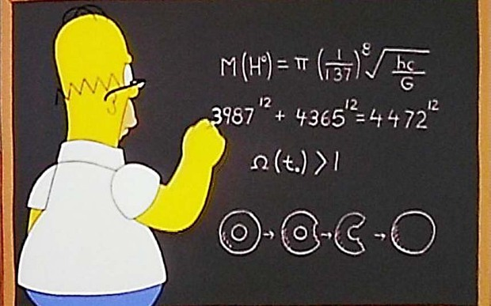
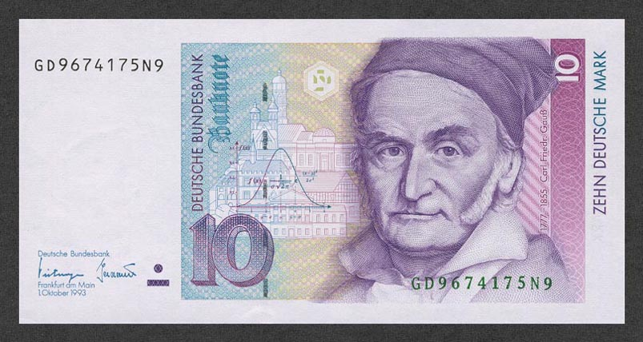

layout: true
class: middle, center

---

# Number Theory: Why Cryptography Works



_"The Wizard of Evergreen Terrace"_

???
Hi fellow Chicago Rubyists!
Today I'm here to talk to you about Number Theory.
Mostly because I think its an interesting and also really important topic,
that people who write code for a living mostly don't seem to care of know much about.
So before I get into this stuff, I'm curious, does anyone know how this image might be relevant?

---

About me...


???
TODO

---

# What is Number Theory?

```ruby
natural_numbers = 0..Float::INFINITY
```

???
A branch of mathematics that deals with the natural numbers,
the non-negative integers, that's 0 to positive infinity.
So 0 to positive infinity? That's still a lot of numbers and doesn't really narrow down what we're talking about.

---


_“Marge and Homer Turn a Couple Play”_

???
Why do I keep showing you images from The Simpsons? Turns out, I like The Simpsons, and The Simpsons is made by some people who really like math!
One of the writers, David X. Cohen, studied Physics at Harvard and went on to get a masters degree in Computer Science fom Berkeley.
And when you're not looking, they also do a good job of sneaking in little bits of mathematics into different episodes.
Here's another image from an episode of The Simpsons called "Marge and Homer Turn a Couple Play".
In it, a baseball player is having relationship problems and he turns to Marge and Homer for help.
In this scene they're at a baseball game, and the jumbotron is asking people to guess the number of attendees at the game.
I'm pretty sure I've been to Sox or Cubs games where they do this.

---

# Lets take a closer look...

## A) 8191
## B) 8128
## C) 8208

???
Is there anything interesting about these numbers?
They seem reasonable for the number of people at a baseball game.
And they're all within about 100 of eachother.
It turns out people who study Number Theory really get a kick out of the numbers on the jumbotron here.

---

```ruby
require 'prime'

8191.prime?
# => true
Prime.prime_division(8191 + 1)
# => [[2, 13]]
(2 ** 13) - 1
# => 8191
```

???
First we have 8191, which is a prime number. This means that it is only evenly divisible by 1 and itself.
For example, 5 is prime since it can only be divided by 1 and 5.
6 is not prime since it can be divided by 2 and 3, in additon to 1 and itself.
Primes are special. They're the building blocks of all of the other natural numbers.
There's a very important theorem in Number Theory, The Fundamental Theorem of Arithmetic, that establishes primes as these building blocks.
It states that all integers greater than 1 can be expressed uniquely as a product of primes.
In Ruby, this is what the class method, prime_division, on the Prime class does.
Given an integer great than 1, it gives you the that number's prime factors.

---

```ruby
require 'prime'

primes = (0..Float::INFINITY).select(&:prime?)
```

???
Primes are neat! But how many are there? Maybe you can just count them all? Computers are fast, right?
This is not going to do you much good, unless you need your computer to get hot, maybe to warm up your coffee?

---

background-image: url(Euclid.jpg)

???
It turns out there are infinitely many primes!
Over 2000 years ago, this was proven by this Greek guy, Euclid.
He's often refered to as "the father of geometry",
so you can thank him for all of the stuff you learned about triangles and parallel lines from when you were in high school.
This proof is one of the big proofs in mathematics, and many mathematicians consider it to be very elegant and beautiful.

---

TODO: infinite primes proof
https://www.youtube.com/watch?v=ctC33JAV4FI
https://en.wikipedia.org/wiki/Euclid%27s_theorem

---

background-image: url(Plimpton_322.jpg)

???
How long has have people been concerned with Number Theory?

---

### _"Mathematics is the queen of the sciences and number theory is the queen of mathematics"_

### Carl Friedrich Gauss




---

# But first...

--


--

# Larry's Three Great Virtues of a Programmer:

???
Before we get into Number Theory, I'd like to talk about Larry Wall a bit. For those of who don't know, Larry Wall is the author of the Perl programming language. But wait! This is a Ruby Meetup, why are we talking about Perl? Well, we're not really talking about Perl, but even if we were I don't think that would necessarily be crazy since Ruby was heavily inspired by Perl. But what I would like to touch on is Larry Wall's three virtues of a great programmer.

---

# 1. Laziness

  _"The quality that makes you go to great effort to reduce overall energy expenditure. It makes you write labor-saving programs that other people will find useful, and document what you wrote so you don't have to answer so many questions about it. Hence, the first great virtue of a programmer."_

---

# 2. Impatence

  _"The anger you feel when the computer is being lazy. This makes you write programs that don't just react to your needs, but actually anticipate them. Or at least pretend to. Hence, the second great virtue of a programmer."_

---

# 3. Hubris

  _"Excessive pride, the sort of thing Zeus zaps you for. Also the quality that makes you write (and maintain) programs that other people won't want to say bad things about. Hence, the third great virtue of a programmer."_

---

# And now for the disclaimer...

--

1. Be lazy, someone else has already done it for you

--

2. Be impatent, review takes a long time

--

3. Have hubris, avoid people saying bad things about your software by not writing it to begin with

???
I think these are some really valuably insights that can lead us to better solve problems, and also solve the better problems. I also think they make for three really good reasons that you probably shouldn't be writing your own cyptographic code, especially when it would be really bad if it didn't exactly work as you had intended.

That being said a great way to learn about Number Theory and Cryptography (or really anything) is do it yourself! And yeah maybe even use it on your blog or your iPhone app your working on that lets people share where with eachother where all the best Pokemons are at! But probably don't use your own cryptosystem if your trying to do things like protect people's medical or financial data.

---

What is a proof?

You might think of a proof from a math class you had, but proofs exist outside math

So what's a higher level notion of what a proof is?

Across many fields, a proof is a method for ascertaining truth:

* Observation and experimentation
  - What makes physics work
  - If we do an experiment 10 times, and every time it comes out the same way, we've ascertained some truth
  - Who really knows if there is gravity? We observe it, and then that's the truth: there is gravity
    * We see how it behaves under different cicrumstances, then we make generalizations
    * We verify those generalizations through experimentation, then those become laws
* Truth is established by juries and judges
  - Someone has alledgedly done a bad thing, witnesses say they saw this person do that, a jury finds this to be compelling evidence, then a verdict is made
  - Not always 100% effective, but like the other methods of proof, it is a method for ascertaining the truth
  - Marge in chains, Bart Gets Hit By a Car
* Sometimes truth comes from authority
  - Truth can get complicated when you have conflicting truths: someone thinks one thing, someone else thinks another
  - Some places I've worked I had superiors that when they said something that was the truth, and you better be okay with that or "you're fired"
  - Teachers or professors, how you did on assignment or test is up to them
* Inner Conviction
  - Popular in computing
    * Emacs vs Vim
    * Tabs vs spaces
    * Ruby vs Python (that other language with the snake)
    * "My code doesn't have any bugs!"
* "I don't see why not!"
  - Particularly effective, since it tranfers the burden of proof to anyone who disagrees with you
  - Now your view is correct until someone else disproves you
* Mathematic Proof: a verification of a proposition by a chain of logical deductions from a set of axioms
  - Proposition: a statement that is true of false
    * e.g. 2 + 3 = 5
    * For every non-negative integer, n, the value of n^2 + n + 41 is a prime number
      - prime number => an integer divisible only by itself and 1
      - predicate => "n^2 + n + 41 is a prime number" in this case, a proposition whose truth depends on some variable(s), n in this case
        * Like a method that returns a boolean in Ruby, e.g.
          ```ruby
          def even?(n)
            n % 2 == 0
          end
          ```
        * This particular predicate can be written as:
          ```ruby
          require 'prime'

          def n_squared_plus_n_plus_41_prime?(n)
            Prime.prime?(n ** 2 + n + 41)
          end
          ```
        * Maybe we can approach this the way physicists do? Lets try a bunch of values for n and see if the results are prime:
          ```
          (0..39).map { |n| n_squared_plus_n_plus_41_prime?(n) }.all?
          # => true
          ```
        * For the first 40 values of n, the proposition holds! Looking good!
        * In a lot of fields this might hold some weight, in medecine for example if a treatment worked for 40 out of 40 patients maybe it will work for all patients?
        * However if we keep trying more values for n:
          ```
          n_squared_plus_n_plus_41_prime?(40)
          # => false
          40 ** 2 + 40 + 41 == 41 * 41
          # => true
          ```
        * Not as rare or contrived an example as you'd guess
        * Many propositions that seem to be true when you check a few cases (or _a lot_ of cases), but which turn out to be false
        * You can’t check a claim about an infinite set by checking a finite set of its elements, no matter how large the finite set!
        * It turns out propositions that involve all of the natural numbers are really common, so mathematicians use some notation to make things more concise:
          - ∀n ∈ ℕ, n^2 + n + 41 is prime
          - ∀ => "For all"
          - ∈ => "is a member of"
          - ℕ => the natural numbers (non-negative integers)
    * Proposition 1.3.2 (https://youtu.be/L3LMbpZIKhQ?t=14m20s)
    * https://en.wikipedia.org/wiki/Mersenne_conjectures
    * ∀x,y,z ∈ ℤ⁺, 313 * (x^3 + y^3) ≠ z^3
      - For all positive integer values of x, y, and z, 313 * (x^3 + y^3) = z^3 has no solutions
      - Lets try to find a counterexample in Ruby:
        ```
        NATURAL_NUMBERS = 0..Float::INFINITY

        def f(x, y)
          313 * (x ** 3 + y ** 3)
        end

        NATURAL_NUMBERS.first(100_000).each do |x|
          NATURAL_NUMBERS.first(100_000).each do |y|
            NATURAL_NUMBERS.first(100_000).each do |z|
              puts "#{x}, #{y}, #{z}" if f(x, y) == z ** 3
            end
          end
        end
        ```
