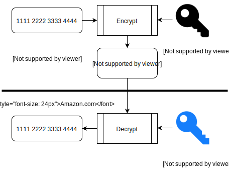

layout: true
class: middle, center

---

# Number Theory: Why Cryptography Works


_"The Wizard of Evergreen Terrace"_

???
Hi fellow Chicago Rubyists!
Today I'm here to talk to you about Number Theory.
It's an interesting topic and also a really important topic,
and one that people who write Ruby mostly don't seem to deal with much, which is unfortunate.
This image is from an episode of The Simsons called "The Wizard of Evergreen Terrace".
In it, Homer begins to admire Thomas Edison and decides to become an inventor.
The second line is a reference to something very important in Number Theory called Fermat's Last Theorem,
which also comes up in Star Trek and Doctor Who.

---

.jv[
  
  
]

--

.logos[
  
  
  
  
  
]

???
First a little bit about myself.
I'm an engineer at Jellyvision, here in Chicago.
We make Alex, which is an interactive conversation that helps people make difficult decisions,
decisions like selecting which health insurance plan is best for you and your family.
We use Ruby, Python, JavaScript, PHP, and also Amazon Web Services.
Like most other software companies, we're hiring.
If any of these things are interesting to you and you happen to be looking for a job,
maybe consider working at Jellyvision.

---

# What is Number Theory?

```ruby
natural_numbers = 0..Float::INFINITY
```

???
So what is Number Theory exactly?
Number Theory is a branch of mathematics that deals with the natural numbers.
The natural numbers are the non-negative integers, so they span from 0 to positive infinity.
In Ruby we can describe the natural numbers using a range, from 0 to the infinity constant in the Float class.
So 0 to positive infinity? That's still a lot of numbers, and this doesn't really narrow down what Number Theory is about.

---


_“Marge and Homer Turn a Couple Play”_

???
To help me show you what Number Theory is about, here's another image from The Simpsons.
Why do I keep showing you images from The Simpsons? It turns out, I like The Simpsons, and also, The Simpsons is made by some people who really like math!
One of the writers, David X. Cohen, studied Physics at Harvard and then went on to get a masters degree in Computer Science fom Berkeley.
And when you're not looking, the writers on The Simpsons do a good job of sneaking in little bits of mathematics into different episodes.
This episode of The Simpsons is called "Marge and Homer Turn a Couple Play".
In this episode, a baseball player is having relationship problems and he turns to Marge and Homer for help.
In this particular scene they're at a baseball game,
and the jumbotron is asking people to guess the number of attendees at the game.

---

# Lets take a closer look...

## A) 8191
## B) 8128
## C) 8208

???
Let's take a closer look at the choices we have for the size of the crowd,
they are 8191, 8128, and 8208.
Is there anything unusual about these numbers?
They seem reasonable for the number of people at a baseball game.
They're all close to 8000, and they're all within about 100 of eachother.
However, these seemingly innocuous numbers are the kind of numbers that people who study Number Theory find very interesting.

---

```ruby
require 'prime'

8191.prime?
# => true
5.prime?
# => true
6.prime?
# => false
```

???
First, we have 8191.
In this snippet of Ruby code, we're first requiring 'prime',
which is part of the Ruby standard library.
This adds the 'prime?' method to the Integer class.
Using this method we see that 8191 is in fact prime.
This means that it is only evenly divisible by 1 and itself.
Another example of a prime number is 5, since it can only be divided by 1 and 5.
6, on the other hand, is not prime since it can be divided by 2 and 3, in additon to 1 and itself.

---

# Fundamental Theorem of Arithmetic (FTA)

### Every integer greater than 1 either is prime itself or is the product of prime numbers, and this product is unique.

`60 = 5 * 3 * 2 * 2`

???
Primes are special. They're the building blocks of all of the natural numbers.
There's a very important theorem in Number Theory, its called The Fundamental Theorem of Arithmetic.
It establishes primes as these building blocks.
It states that all integers greater than 1 can be expressed uniquely as a product of primes.
Another way to think about this is that if mathematics had a Periodic Table, instead of listing the elements it would list prime numbers.
Integers are like a chemical compounds, which are unique combinations of atoms, which are like primes.
For example, the only way to express 60 as a product of primes is 5 * 3 * 2 * 2.
Every other integer greater than 2 has one, and only one, unique prime factorization.
This theorem is one of the main reasons we don't consider 1 to be a prime number.
If 1 were prime, prime factorizations wouldn't be unique since you can always multiply a number by 1 and end up with that same number.

---

```ruby
require 'prime'

Prime.prime_division(6)
# => [[2, 1], [3, 1]]
(2 ** 1) * (3 ** 1)
# => 6

Prime.prime_division(5)
# => [[5, 1]]
5 ** 1
# => 5

Prime.prime_division(2940)
# => [[2, 2], [3, 1], [5, 1], [7, 2]]
(2 ** 2) * (3 ** 1) * (5 ** 1) * (7 ** 2)
# => 2940
```

???
So the Fundamental Theorem of Arithmetic says we can break down integers into unique products of primes.
In Ruby, the class method 'prime_division' does this for us.
It takes an integer, and returns an array of arrays of integers.
Each inner array has two integers, and maps to a specific prime, which is the first integer in that array.
The second number is the number of times you multiply that number, along with the other prime numbers, to get the origional number.
For example, 6's prime division gives us back 2 sub-arrays, the first containing 2 and 1, the second containing 3 and 1.
This means that if we want to get 6 back from this decomposition, we multiply 2^1 times 3^1.

---

```ruby
Prime.prime_division(8191 + 1)
# => [[2, 13]]
(2 ** 13) - 1
# => 8191
```

???
Back to 8191, in addition to being a prime number, this number has another interesting property.
When you add 1 to it, and then you decompose it into its prime factors, you end up with 13 2's.
So 8191 is a prime number that is 1 less than 2^13, which makes it an even more special kind of prime.
Mathematicians have a name for these, they're called Mersenne Primes.
Mersenne Primes are named after Marin Mersenne.
Mersenne was a French theologian and mathematician who studied these kinds of numbers around 400 years ago.

---

# 2<sup>74207281</sup> − 1

300376418084606182052986098359166050056875863030301484843941
693345547723219067994296893655300772688320448214882399426831

... (22,338,378 digits omitted) ...

717774014762912462113646879425801445107393100212927181629335
931494239018213879217671164956287190498687010073391086436351

???
Another cool thing about Mersenne Primes is that the 11 largest known prime numbers are all Mersenne Primes,
they can all be written in the form of 2 to some power minus 1.
This huge number, and I'm not going to even try to pronounce any of its over 22 million digits,
was discovered in January this year by the Great Internet Mersenne Prime Search.
It is the largest known prime number.
The Great Internet Mersenne Prime Search is a public distributed computing project devoted to finding Mersenne Primes.

---

```ruby
def powers_of_2
  (0..Float::INFINITY).lazy.map { |n| 2 ** n }
end

def mersenne_primes
  powers_of_2.map { |n| n - 1 }.select(&:prime?)
end

mersenne_primes.first(8)
# => [3, 7, 31, 127, 8191, 131071, 524287, 2147483647]
```

???
Here's how you could find these in Ruby.
You could take powers of 2, subtract 1 from them, and then keep the ones that are prime.
Here's the first 8. The 5th one here should look familiar, that's our friend 8191.
That last one here, 2,147,483,647, was first discovered by the Swiss mathematician Leonhard Euler in 1772.
Does anyone know why else this number is important in computing?
It also happens to be the max positive value for a 32-bit signed integer.
This doesn't come up in Ruby much since Fixnums are automatically converted to Bignums automatically,
but it's definitely something to watch out for if you're working with really big numbers in a language like Java or C.

---

## 2<sup>31</sup> - 1 = 2147483647


# e<sup>iπ</sup> + 1 = 0

## _"The most remarkable formula in mathematics"_

???
Here he is on the Swiss 10 Franc bank note.
He made tons of contributions to different branches of mathematics and physics.
He's widely considered to be the most prolific mathematician of all time.
He's probably best known for Euler's Identity, named after him, which is special case of the more generic Euler's Formula.
It's not really a Number Theory thing, but have people seen this before?
Yes? You probably studied math or engineering in college?
Richard Feynman refered to this as the most remarkable formula in mathematics.
The reason it's so cool is that it relates the fundamental constants 0, 1, e, i and π,
and it does this in such a short and simple equation.
The constant e was also named in Euler's honor.
Not just anyone can get an important constant like e named after them and also show up on their country's money.
The guy knew what he was doing.

---

# A) 8191
# B) 8128
# C) 8208

???
Option A, 8191 is an interesting number beecause it's a Mersenne Prime.
But what about option B? 8128?
It's definitely not prime since it ends in 8, which is divisible by 2.
Any thoughts on why else this number might be interesting?

---

```ruby
class Integer
  def other_divisors
    1.upto(self - 1).select { |n| self % n == 0 }
  end
end

6.other_divisors
# => [1, 2, 3]
8191.other_divisors
# => [1]
```

???
I'm not a big fan of adding methods to core Ruby classes,
but I won't get too much into that, since it could be the topic for another talk.
However, I feel like it's appropriate for the purpose of demonstrating why 8128 is interesting.
This method 'other_divisors' that I've added to the Integer class,
just returns an array of all other integers that evenly divide it.
It's just iterating over 1 through 1 less than itself and checking whether those divide it evenly.
6, for example, in addition to being divisible by itself, is divisible by 1, 2, and 3.
On the other hand, 8191, which we're already familiar with, is prime, so the only other number that divides it evenly is 1.

---

```ruby
6.other_divisors
# => [1, 2, 3]
6.other_divisors.reduce(:+)
# => 6
```

???
Look what happens when we add up 6's other divisors. We get 6 back!
This is yet another kind of number that mathematicians have had a name for, for a very long time.
Can anyone think of the next number that has this property?
Something where we can take all of its other divisors and add them up, and then get back that same number?

---

```ruby
def perfect_numbers
  (1..Float::INFINITY).
    lazy.
    select { |n| n.other_divisors.reduce(:+) == n }
end

perfect_numbers.first(4)
# => [6, 28, 496, 8128]
```

???
These kinds of numbers, whose divisors other than themselves, that add up to themselves, are called perfect numbers.
Lets take a look at how we're describing these in Ruby.
Here we've defined perfect numbers as integers greater than 0, whose other divisors add up to themselves.
And there we have it, 8128 is interesting because its the 4th perfect number.
We've already seen the smallest perfect number, 6 since it has 3 other divisors: 1, 2, and 3, which add up to 6.
28 is the second perfect number.
Its divisors are 1, 2, 4, 7, 14, which add up to 28.

---

Rank | Perfect number      | Mersenne Prime | p(p+1)/2
-----|---------------------|----------------|-------------
1    | 6                   | 3              | 3(3+1)/2
2    | 28                  | 7              | 7(7+1)/2
3    | 496                 | 31             | 31(31+1)/2
4    | 8128                | 127            | 127(127+1)/2
5    | 33550336            | 8191           | 8191(8191+1)/2
6    | 8589869056          | 131071         | 131071(131071+1)/2
7    | 137438691328        | 524287         | 524287(524287+1)/2
8    | 2305843008139952128 | 2147483647     | 2147483647(2147483647+1)/2

???
But that's not all about perfect numbers!
Euler, in additon to doing the other cool stuff I told you about,
also proved a theorem that all even perfect numbers are of the form p(p+1)/2, where p is a Mersenne Prime.
This means that the nth perfect number can be used to generate the nth Mersenne Prime.
And this works in the opposite direction too, the nth Mersenne Prime can be used to generate the nth perfect number.
This table contains the first 8 pairs of perfect numbers and Mersenne Primes, and also how to transform one into the other.
I've only listed the first 8 pairs here, since they start to get really big after this.
The next perfect number is 37 digits long.

---

# `(2^74207281 − 1)(2^74207281)/2`

## _"Perfect numbers, like perfect men, are very rare."_

### René Descartes

???
Using the formula for converting a Mersenne Prime into a perfect number, from the previous slide,
and using the largest known Mersenne Prime, that is 2 to the 74,207,281 st power minus 1,
we can compute the largest known perfect number as such.
If we were to do the actual computation, the resulting number would be a whopping 44 million digits long.
I didn't yet mention how many perfect numbers and Mersenne primes there are.
This pair, which was discovered in January, is the 49th that we know of.
It is conjectured that there are infinitely many perfect numbers and Mersenne Primes, but a formal proof for this is still unknown.
So if you can prove that there are infinitely many of these, you can be a big-shot mathematician just like Euler!
René Descartes, the Frech philospher and mathematician, died in 1650.
Back then, there were only 7 known perfect numbers, the largest having 12 digits.
Today we know of 49, 7 times the amount Descartes would've known of.
The largest is this crazy big number, so it's hard to argue with Descates on these perfect numbers being very, very rare.

---

# A) 8191
# B) 8128
# C) 8208

???
Option B, we know that one is important because its a perfect number.
How about option C?
This one, 8208, is special because it's a narcissistic number.

---

```ruby
class Integer
  def narcissistic?
    digits = to_s.chars.map(&:to_i)
    digits.map { |d| d ** digits.length }.
      reduce(:+) == self
  end
end

(1 ** 2) + (2 ** 2)
# => 5
(8 ** 4) + (2 ** 4) + (0 ** 4) + (8 ** 4)
# => 8208

12.narcissistic?
# => false
8208.narcissistic?
# => true
```

???
8208 is a narcissistic number since 8^4 + 2^4 + 0^4 + 8^4 = 8208.
They're called narcissistic since the number kind or recreates itself from its own digits,
so maybe they're a little self-obsessed or something.
Here's how you could represent narcissistic numbers is Ruby.
This is not the most elegent code, so let me explain what's going on here.
For the integer we're calling the 'narcissistic?' method on,
we're first converting it to an array of its digits.
Then we're taking the sum of each of those digits raised to the power of the total number of digits.
And finally we check to see if that sum is equal to the origional integer.
Unlike Mersenne primes or perfect numbers, whether or not a number is narcissistic depends on the base its written in.
For example, the only narcissistic base 3 numbers are: 0, 1, 2, 5, 8, and 17.

---

# That's nice but...

## Netflix costs $7.99
## 1.60934 km = 1 mi
## π = 3.14159...

???
So those 3 numbers were fun to think about, and clearly there are a lot of patterns witin the natural numbers,
but what good is this to anybody? The real world is much messier than the world of the natural numbers.
The real world is continuous, not discrete.
We care about things with values that are between integers: stuff like money, distance, fractions, or important values like π.
So maybe you'd think Number Theory isn't very useful.
And 100 years or so ago you would've been right, Number Theory didn't have many applications.
However, this changed entirely with computing.

---

### _"Virtually every theorem in elementary number theory arises in a natural, motivated way in connection with the problem of making computers do high-speed numerical calculations"_

#### Donald Knuth

???
Computers represent everything with discrete bits.
Even numbers like π can be approximated with floating-point represenations.
And if you don't believe me that Number Theory is useful, here's a quote from someone much smarter than me, Donald Knuth.
Some areas in computing where Number Theory is very important are:
hash functions, pseudorandom numbers generation, doing fast arithmetic operations,
and also cryptography.
We all use these things on a daily basis, and probably most of the time we don't even realize it.

---

# Symmetric key encryption


???
Cryptography is about constructing and analyzing systems that prevent third parties from reading private messages.
For example, say I want to buy something on Amazon.com.
They need my credit card number, and I'd like to be able to send them that,
with confidence that only they will be able to read it.
I'm going to be sending Amazon my credit card number over the internet,
and the internet is big, complicated, and full of eavesdroppers.
How can we beat the eavesdroppers?
One way to do this, is if I and Amazon.com have a shared secret key, like a password, that no one else knows.
I can use this key to encrypt my credit card number,
I send this encrypted text, called the cipher text, over the internet to Amazon.com.
If anyone else sees my encrypted card number, to them, it will look like nonsense.
Amazon.com however, since they have the same key I have,
they're able to take the nonsense I send them, and turn it back into my credit card number.

---

# Encrypt

```ruby
require 'openssl'
require 'digest'

plain_text = 'Very, very secret message'
key = Digest::SHA256.digest 'password'
iv = Digest::SHA256.digest 'initialization vector'

cipher = OpenSSL::Cipher::AES.new(256, :CBC)
cipher.encrypt
cipher.key = key
cipher.iv = iv

cipher_text = cipher.update(plain_text) + cipher.final
# => "\x1Ea\xB0\x8DXC\xE8\x94\x19DR\xF3\xC1\xCF$\xC6\x92}\xAAg\xA6~\x9B\x15\xB2\xCA\xA7sbDe:"
```

???
In pratice, we can do this in Ruby using AES, which is a commonly used algorithm for symmetric encryption.
We call new on the AES class, passing in the size of the key we want to use, 256 bits in this base.
We also need to give it a cipher mode. Here we're using CBC, which stands for cipher block chaining.
Since we're using cipher block chaining, we also need an initialization vector.
This is used to encrypt each 128 bit block of our plain text differently.
We tell our instance of the AES class that we want to use it for encryption.
We also tell it our key, and our initialization vector.
Then to generate the cipher text, we call update on the cipher, passing in the plain text.
Since we're using cipher block chaining, we also need to append the final output of the chaining process.
This is which is what adding 'cipher.final' does.
We're left with the cipher text, which you need the key and initialization vector to decrypt.

---

# Decrypt

```ruby
decipher = OpenSSL::Cipher::AES.new(256, :CBC)
decipher.decrypt
decipher.key = key
decipher.iv = iv

decipher.update(cipher_text) + decipher.final
# => "Very, very secret message"
```

???
On the other end, decryption works similarly.
We instantiate another AES object, with the same number of bits for the key, and also the same cipher mode.
This time though, we call 'decrypt' on it, so that we can convert cipher text to plain text.
We set the key and initialization vector, and then we're then ready to decrypt.
Appending the output of 'final' to the output of 'update' results in the message we started with.
This works pretty well when both parties have a shared key.
But in most cases, this isn't practical.
You can't just meet face to face with an Amazon employee to decide on a key to use for all of your communications.
And even if you could, sites like Amazon.com would need to keep track of a key for every single one of their customers.
We need something different, and Number Theory can help.

---

# Public key encryption



???
In public key cryptography, instead of having a single key which is shared, instead we have key pairs.
To send a message to someone securely, all you need is their public key.
You use this public key to encrypt your message. The only way to decrypt this message is with the private key.
In this example I use Amazon's public key to encrypt my credit card number, then I send them the cipher text over the internet.
Since they have the private key, they're able to use that to decrypt my credit card number.
This is really awesome since it allows us to secure communations between two parties without them needing a shared secret.
But how does this work? How are the public and private keys linked?

---

```ruby
class Integer
  def phi
    (1..self).count { |n| n.gcd(self) == 1 }
  end
end

9.phi
# => 6
(1..8).select { |n| n.gcd(9) == 1 }
# => [1, 2, 4, 5, 7, 8]

8191.phi
# => 8190
```

???
Before we get into this, there's one other function you should know about.
It's called Euler's Phi Function, or just phi for short, and yes it's named after the same Euler we were talking about earlier.
This function, sort of describes the breakability of a number.
Given n, the value of phi of n is the count of integers up to n that are relatively prime with n.
For two numbers to be relatively prime, their greatest common divisor must be 1.
For example, phi(9) is 6, since six numbers are less than 9 that are relatively prime with it.
These are: 1, 2, 4, 5, 7 and 8. None of them have a common divisor greater than 1, with 9.
When we compute phi for a prime, we get that prime minus 1.
This is because the only numbers that divide a prime number are 1 and that number itself,
so all the numbers below that prime are relatively prime with it.
This makes phi really easy to compute for prime numbers, we don't need to search all the numbers below.
We just need to subtract 1.

---

```ruby
21.phi * 37.phi == (21 * 37).phi
# => true

(8191 * 7).phi == (8191 - 1) * (7 - 1)
# => true
```

Phi is also multiplicative.
This means phi of two numbers multiplied together is the same as phi of those numbers individually, then multiplied.
This makes it easy to compute phi of the product of two prime numbers,
since this would just be 1 minus each of those numbers multiplied together.
For example, since we know that 8191 and 7 are prime, we know that phi(8191 * 7) equals (8191 - 1) * (7 - 1).
This property of prime numbers and the phi function is what allows us to use two prime numbers as parts of a key pair,
we designate one prime to be the public key and the other to be the private key.

---


---

```ruby
require 'prime'

primes = (0..Float::INFINITY).select(&:prime?)
```

???
Primes are neat! But how many are there? Maybe you can just count them all? Computers are fast, right?
This is not going to do you much good, unless you need your computer to get hot, maybe to warm up your coffee?

---

background-image: url(Euclid.jpg)

???
It turns out there are infinitely many primes!
Over 2000 years ago, this was proven by this Greek guy, Euclid.
He's often refered to as "the father of geometry",
so you can thank him for all of the stuff you learned about triangles and parallel lines from when you were in high school.
This proof is one of the big proofs in mathematics, and many mathematicians consider it to be very elegant and beautiful.

---

TODO: infinite primes proof
https://www.youtube.com/watch?v=ctC33JAV4FI
https://en.wikipedia.org/wiki/Euclid%27s_theorem

---

background-image: url(Plimpton_322.jpg)

???
How long has have people been concerned with Number Theory?

---

### _"Mathematics is the queen of the sciences and number theory is the queen of mathematics"_

### Carl Friedrich Gauss


---

# But first...

--


--

# Larry's Three Great Virtues of a Programmer:

???
Before we get into Number Theory, I'd like to talk about Larry Wall a bit. For those of who don't know, Larry Wall is the author of the Perl programming language. But wait! This is a Ruby Meetup, why are we talking about Perl? Well, we're not really talking about Perl, but even if we were I don't think that would necessarily be crazy since Ruby was heavily inspired by Perl. But what I would like to touch on is Larry Wall's three virtues of a great programmer.

---

# 1. Laziness

  _"The quality that makes you go to great effort to reduce overall energy expenditure. It makes you write labor-saving programs that other people will find useful, and document what you wrote so you don't have to answer so many questions about it. Hence, the first great virtue of a programmer."_

---

# 2. Impatence

  _"The anger you feel when the computer is being lazy. This makes you write programs that don't just react to your needs, but actually anticipate them. Or at least pretend to. Hence, the second great virtue of a programmer."_

---

# 3. Hubris

  _"Excessive pride, the sort of thing Zeus zaps you for. Also the quality that makes you write (and maintain) programs that other people won't want to say bad things about. Hence, the third great virtue of a programmer."_

---

# And now for the disclaimer...

--

1. Be lazy, someone else has already done it for you

--

2. Be impatent, review takes a long time

--

3. Have hubris, avoid people saying bad things about your software by not writing it to begin with

???
I think these are some really valuably insights that can lead us to better solve problems, and also solve the better problems. I also think they make for three really good reasons that you probably shouldn't be writing your own cyptographic code, especially when it would be really bad if it didn't exactly work as you had intended.

That being said a great way to learn about Number Theory and Cryptography (or really anything) is do it yourself! And yeah maybe even use it on your blog or your iPhone app your working on that lets people share where with eachother where all the best Pokemons are at! But probably don't use your own cryptosystem if your trying to do things like protect people's medical or financial data.

